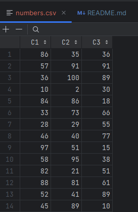
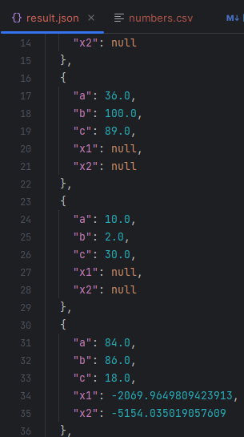

# Погружение в Python. Декораторы.

Напишите следующие функции:
- Нахождение корней квадратного уравнения  
- Генерация csv файла с тремя случайными числами в каждой строке. 100-1000 строк. 
- Декоратор, запускающий функцию нахождения корней квадратного уравнения с каждой тройкой чисел из csv файла. 
- Декоратор, сохраняющий переданные параметры и результаты работы функции в json файл. 

**Пример выполнения**

Сгенерированный csv:

Вывод списка решения:

Сгенерированный json:

Соберите пакет с играми из тех файлов, что уже были созданы в рамках курса

Пакет в каталоге libs. 